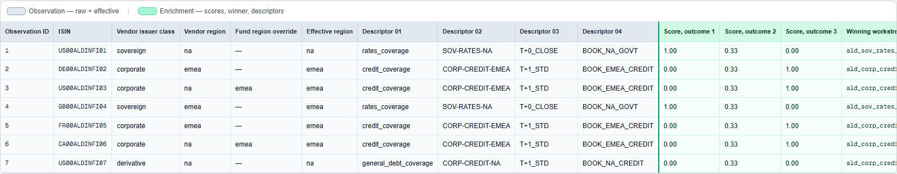

# SQL expert system + semantic layer (portfolio)


## The business problem

**Context.** Asset managers run on **vendor reference data**—classifications, regions, rating bands—delivered with each security. That feed is the **operational source of truth** for risk, settlements, compliance, and reconciliation. Editing it in place is usually a bad trade: you weaken the audit trail to what the vendor asserted and you fight the feed on every refresh.

**The tension.** Portfolio and operating teams still need **internal** semantics that legitimately differ: mandates and sleeves, desk or book ownership, risk and PnL aggregation, capacity, client reporting. Those cuts rarely match the vendor’s taxonomy exactly (e.g. a **North America–listed** name **managed from EMEA**). The business ask is to **route, label, and report** on **fund-owned** views while **preserving** raw vendor fields wherever the platform must stay aligned with the external record.

**Approach.** A **semantic layer**: optional **fund overrides** on vendor attributes. Overrides define **effective** labels for scoring and routing; original **`ald_*`** columns stay on the row for lineage. Outcomes (workstreams, descriptors) are chosen by a **kernelized** rule engine—described next, then in full detail below.

**What this repo is.** A **portfolio demonstration**, not a shipping system. It is meant to demonstrate **a real business solution** by combining **applied mathematics** (qualitative facts → a structured linear score → a discrete decision) with **software engineering** (executable SQL, clear data / policy / computation boundaries, a design that stays tractable at scale). The walkthrough is **minimal PostgreSQL** on synthetic data: `ald_*` + nullable `fund_*_override` → **effective** → kernelization → sparse scores → **argmax** → **`ENRICHED_OBSERVATION_ROW`**, including a **region override** that treats a US corporate as **EMEA** for internal routing **without** mutating the vendor feed.

*Aladdin® is a registered trademark of BlackRock, Inc. This project is **not** affiliated with BlackRock, uses **no** vendor or production data, and all ISINs are **fabricated**.* It is a **public, synthetic** companion to a production system I built elsewhere; org-scale context and lessons are in **`docs/case-study.md`**.

## The kernelization idea (general pattern)

**In one picture:** you have a **large** set of observations and a **much smaller** qualitative catalog (rules, taxonomies, policy rows). **Kernelization** maps **both** into the **same** dictionary of atomic binary features—**sparse** 0/1 vectors (only a handful of dimensions “on” per row). **Compatibility** is expressed with dot products under explicit rules (e.g. wildcards); **choice** is **aggregate + `argmax`**. Conceptually that is **fast enrichment**: the rich structure lives in the **small** rule side; each observation only carries **short** activations—closer to a **join** than to ad hoc string logic on every row.

**Why it travels.** The same recipe applies whenever a **small curated catalog** must attach **scores, routes, or labels** to **very many** categorically described rows: **shared sparse basis → inner products → reduce** (max, top-k, …). Think rule engines, entitlements, coarse recommenders, multi-axis classification—not only reference-data enrichment. **On a GPU**, the hot path is **batched linear algebra** with a **small broadcast** rule block and **parallel per-row** reductions—favorable memory patterns versus thread-divergent string branching.


The rest of this README **instantiates** the pattern in Postgres and spells out math, SQL, and a worked table example.

## Enriched output (toy UI)



## How the scoring engine works

**Framing.** Treat this as an **expert system**: human-authored wildcard rules, sparse compatibility scores, deterministic **argmax**. The **semantic layer** is the override story—`fund_*_override` over **`ald_*`** → **effective** labels for scoring, with vendor lineage retained on the output row.

### Kernelization, matrix-style scoring, and gating

**Qualitative → numeric.** **Kernelization** maps each row’s **effective** labels into a **sparse binary vector** $d_j \in \{0,1\}^M$ over a **fixed dictionary** (e.g. `fi_corporate`, `region_emea`)—categories made concrete for algebra without fake real-valued encodings.

**Scoring under constraints.** Observations get a normalized hierarchy (up to 7 levels; often 3), kernelized to sparse axis–value features, then matched to kernelized rules via sparse dot products. `*` = axis unspecified; non-wildcard mismatches zero the score. Denominator normalizes by non-wildcard rule axes (floored at `3` for backward compatibility). **Dimension rules** (one-level tags) attach descriptors separately from the hierarchy decision.

**Gating.** $\arg\max_i s_{ij}$ with a fixed tie-break is **winner-take-all**—no softmax, depth, or training loop. You can read it as **score vector + hard max** from sparse dot products over kernelized axes.

### Stakeholder view (what each run decides)

Per security: one **winning workstream** (argmax) plus attached descriptors. Inputs: **`ald_*`** + optional overrides; scoring uses **effective** values. Output: one enriched row with lineage and decision fields.

**Facts vs policy vs math:** **Effective** = non-blank override else **`ald_*`**; hierarchy from effective issuer (`Debt/Govt|Corp|Deriv/…`). **Policy:** highest score wins; ties break on fixed **`rule_id`** order (production had additional waterfall rules—`docs/case-study.md`). **Out of scope:** continuous allocation or optimization over $x\in\mathbb{R}^n$.

### Technical primer: matrix-style scoring and argmax gate

**Notation.** $N$ = number of outcomes (workstreams). For observation $j$, hierarchy matching yields a score vector $(s_{1j}, \ldots, s_{Nj})$ where each $s_{ij}$ is the maximum compatibility score among hierarchy rows mapped to outcome $i$.

**Hierarchy score (sparse kernel dot-product under constraints).** For each hierarchy rule $r$ and observation $j$, build sparse vectors over hierarchy axes (up to 7 levels) and compute:

$$
\text{score}_{rj} =
\begin{cases}
\dfrac{d_j^\top k_r}{\max(\|k_r\|_0, 3)}, & \text{if all non-wildcard axes in } r \text{ match } j\\
0, & \text{otherwise}
\end{cases}
$$

and the outcome score is the maximum rule score among rows for that outcome.

The denominator is **not a fixed `/3`**. It is the rule's non-wildcard axis count, with a floor of `3` retained for backward compatibility with the original 3-level scoring behavior.

**Wide scores and ranking.** Internally the enriched routine still forms outcome score slots (`a`,`b`,`c`) and applies argmax ranking deterministically (tie-break by `rule_id`).

**Logic gate (hard max).** The discrete decision is

$$
i^\star(j) \in \arg\max_{i=1,\ldots,N} s_{ij},
$$

with a **deterministic tie-break** among argmax ties (smallest `rule_id` in the demo). That is winner-take-all gating: no softmax, no temperature, no gradient-based learning.

*Why **`single-neuron-semantic-layer`**?* The scoring story is shallow on purpose: **sparse linear scores** in (dot products against hand-maintained rule kernels), then a single **hard `argmax`**—no depth, no softmax, no training loop. If you squint, that is a one-neuron mood: one linear layer’s worth of arithmetic and a winner-take-all “activation.” 

**Problem class.** Not LP/QP/MILP over continuous $x$: **linear functionals** of fixed binary $d_j$ plus **discrete max** over finitely many outcomes—fast, auditable; not a probability model.

### From matrix to multi-rule-family

Conceptually: observations × hierarchy rules, plus **separate** dimension-rule families. In SQL: **two** sparse 2D passes (hierarchy → argmax; dimensions → extra descriptors) merged deterministically—tensor-flavored, but kept flat for clarity and plans.

### Runtime practicality at large scale

Sparse matching + aggregation, not row-wise string soup. **Flow:** ingest → overrides → effective features → sparse scores → argmax → attach descriptors. **Scale:** cost tracks **active** features, not full rule text. **Ops:** precompute observation features where helpful; index join keys; selective TVFs/APIs with required keys; batch deltas; **version** rule snapshots on scored rows (explainability after edits).

### Reproducibility

- **Fixture + routines:** `sql/postgres/demo.sql` — seven synthetic FI rows, `demo_get_dense_scores()`, `demo_get_enriched_rows()` (shared by script output and API).
- **Run:** Quick start below; or Docker: `.\scripts\run_postgres_demo_docker.ps1` / `bash scripts/run_postgres_demo_docker.sh` (ephemeral `postgres:16-alpine`, prints **`ENRICHED_OBSERVATION_ROW`**).
- **Parse-only:** `pip install pglast` && `python scripts/verify_postgres_demo.py`.
- **UI:** `web/` (Prisma + Postgres, rule CRUD, `/enriched`, OpenAPI at `/api-docs`). After SQL load: `cd web && npm install && npm run db:generate && npm run dev` (see `web/.env.example`).

### Limitations (negative space)

- Scores $s_{ij}$ are **not** claimed to be calibrated probabilities; interpreting them across securities or portfolios requires an explicit business definition.
- Hierarchy rules and overrides need governance (who can change patterns or wildcard precedence, and how conflicts are reviewed)—errors are operational, not mathematical.
- This repo does **not** reproduce production **scale** mechanics (indexed TVFs, staging on read replicas, etc.); those are described in `docs/case-study.md`.

## Worked example (Aladdin-style FI data + fund overrides)

Seven synthetic rows: **`ald_*`** plus optional **`fund_*_override`**; **effective** = override when non-blank, else vendor. Match **`demo_observations`** / **`ENRICHED_OBSERVATION_ROW`** in `sql/postgres/demo.sql` to the tables below.

### Inputs: vendor hierarchy vs fund overrides

Illustrative layout: **Aladdin-classified** columns plus **fund** columns (same names as `demo_observations`). *Description / asset type / ccy* are **README-only** context.

| isin | illustrative name | asset type | **ald_issuer_class** | **fund_issuer_class_override** | **ald_region** | **fund_region_override** | **ald_rating_band** | **fund_rating_band_override** |
|------|-------------------|------------|----------------------|--------------------------------|----------------|---------------------------|---------------------|-------------------------------|
| US00ALDINFI01 | US Treasury note (synthetic) | Govt | sovereign | *(none)* | na | *(none)* | ig | *(none)* |
| DE00ALDINFI02 | EUR corporate note (synthetic) | Corp | corporate | *(none)* | emea | *(none)* | core | *(none)* |
| US00ALDINFI03 | US corporate bond (synthetic) | Corp | corporate | *(none)* | na | **`emea`** | core | *(none)* |
| GB00ALDINFI04 | UK gilt (synthetic) | Govt | sovereign | *(none)* | emea | *(none)* | ig | *(none)* |
| FR00ALDINFI05 | FR corporate note (synthetic) | Corp | corporate | *(none)* | emea | *(none)* | ig | **`core`** |
| CA00ALDINFI06 | CA corporate note (synthetic) | Corp | corporate | *(none)* | na | **`emea`** | core | *(none)* |
| US00ALDINFI07 | US FI derivative (synthetic) | Deriv | derivative | *(none)* | na | *(none)* | core | *(none)* |

**Row 3 story:** Aladdin still books the name in **North America** (`ald_region = na`), but the fund sets **`fund_region_override = emea`** so—**for internal aggregation and workstream routing**—it is treated like an **EMEA corporate** (e.g. to align with a sleeve or mandate view) **without editing the vendor feed**.

- **Effective for scoring:** rows 3 and 6 behave as **corporate + emea + core** → same feature vector as row 2 → **corporate credit (EMEA)** wins.
- **`rating_band` = `core`:** no `rating_ig` bit in this toy; not a literal Aladdin enum.

### Inputs: subject options (workstreams)

Each row is a candidate **downstream workstream**. `decision_code` is the key selected by **argmax**.

| decision_code (system key) | Aladdin-style workstream label |
|----------------------------|--------------------------------|
| `ald_sov_rates_na` | Sovereign & rates — North America |
| `ald_corp_credit_na` | Corporate credit — North America |
| `ald_corp_credit_emea` | Corporate credit — EMEA |

Experts maintain wildcard hierarchy rules; the engine kernelizes, scores, reshapes wide outcome slots (`a`/`b`/`c`), and argmaxes (tie-break `rule_id`).

### Output: enriched rows (vendor + overrides + effective + winner)

**`ENRICHED_OBSERVATION_ROW`** mirrors SQL output: full `ald_*`/`fund_*`, computed `effective_*`, scores, winning workstream, hierarchy descriptors, and dimension descriptors.

| isin | ald_region | fund_region_override | effective_region | effective_issuer | effective_rating | score_a | score_b | score_c | winning_workstream | winning_score | descriptor_01 | descriptor_02 | descriptor_03 | descriptor_04 |
|------|------------|----------------------|------------------|------------------|------------------|---------|---------|---------|---------------------|---------------|---------------|---------------|---------------|---------------|
| US00ALDINFI01 | na | | na | sovereign | ig | 1.00 | 0.33 | 0.00 | `ald_sov_rates_na` | 1.00 | rates_coverage | SOV-RATES-NA | T+0_CLOSE | BOOK_NA_GOVT |
| DE00ALDINFI02 | emea | | emea | corporate | core | 0.00 | 0.33 | 1.00 | `ald_corp_credit_emea` | 1.00 | credit_coverage | CORP-CREDIT-EMEA | T+1_STD | BOOK_EMEA_CREDIT |
| US00ALDINFI03 | na | emea | **emea** | corporate | core | 0.00 | 0.33 | 1.00 | **`ald_corp_credit_emea`** | 1.00 | credit_coverage | **CORP-CREDIT-EMEA** | **T+1_STD** | **BOOK_EMEA_CREDIT** |
| GB00ALDINFI04 | emea | | emea | sovereign | ig | 1.00 | 0.33 | 0.00 | `ald_sov_rates_na` | 1.00 | rates_coverage | SOV-RATES-NA | T+0_CLOSE | BOOK_NA_GOVT |
| FR00ALDINFI05 | emea | | emea | corporate | core | 0.00 | 0.33 | 1.00 | `ald_corp_credit_emea` | 1.00 | credit_coverage | CORP-CREDIT-EMEA | T+1_STD | BOOK_EMEA_CREDIT |
| CA00ALDINFI06 | na | emea | **emea** | corporate | core | 0.00 | 0.33 | 1.00 | **`ald_corp_credit_emea`** | 1.00 | credit_coverage | **CORP-CREDIT-EMEA** | **T+1_STD** | **BOOK_EMEA_CREDIT** |
| US00ALDINFI07 | na | | na | derivative | core | 0.00 | 0.33 | 0.00 | `ald_corp_credit_na` | 0.33 | general_debt_coverage | CORP-CREDIT-NA | T+1_STD | BOOK_NA_CREDIT |

**Readout:** Sovereign rows align to the exact sovereign hierarchy rule and get `descriptor_01 = rates_coverage`; corporate rows align to the exact corporate rule and get `credit_coverage`; derivative row 7 falls through to the wildcard fallback (`Debt` + `*` + `*`) and gets `general_debt_coverage`. Rows 3 and 6 show the Aladdin-vs-fund tension directly: vendor region is **NA**, fund override rebooks to **EMEA**, and decisioning follows **effective** values without mutating the vendor feed. Hierarchy descriptors and independent dimension descriptors are both attached to the same enriched row.

## Quick start (PostgreSQL)

```bash
# From repo root — Aladdin-style FI demo (synthetic ISINs); adjust connection flags
psql -U postgres -d postgres -f sql/postgres/demo.sql
```

After a successful run, **`demo_*` tables remain** in the database so you can run your own `SELECT`s; re-running the script replaces them.

### Without local `psql` (Docker)

If you have **Docker** but no PostgreSQL client on the host, run the same script inside an ephemeral server (pulls `postgres:16-alpine` on first use):

```powershell
# Windows (PowerShell), from repo root
.\scripts\run_postgres_demo_docker.ps1
```

```bash
# macOS / Linux (bash), from repo root
bash scripts/run_postgres_demo_docker.sh
```

Use a different image tag if needed: `.\scripts\run_postgres_demo_docker.ps1 -PostgresImage postgres:17-alpine` (PowerShell) or `POSTGRES_IMAGE=postgres:17-alpine bash scripts/run_postgres_demo_docker.sh` (bash).

Opening `README.md` in a browser as a file usually shows **plain text**. Use your editor’s Markdown preview, or view the repo on **GitHub**, where the home-page README is rendered (including math).

## After you create a GitHub remote

```bash
cd semantic-layer-sql-expert-system
git init
git add .
git commit -m "Initial commit: case study and synthetic SQL demos"
git branch -M main
git remote add origin https://github.com/YOUR_USER/YOUR_REPO.git
git push -u origin main
```

If you **already created an empty repo on GitHub**, clone it into this folder’s parent and copy these files in, or add `origin` as above.

**Git author:** If the first commit used placeholder `user.name` / `user.email` (local to this repo only), set your real identity and fix the author:

```bash
git config user.name "Your Name"
git config user.email "you@example.com"
git commit --amend --reset-author --no-edit
```

## Future enhancements

**SQL performance** ([background article](https://dispassionatedeveloper.blogspot.com/2020/04/building-sql-based-expert-system-for.html); production tactics in `docs/case-study.md`): selective TVFs/contracts with **required keys**; **pre-kernelized** binary features; short identifier churn in hot paths; **staged + indexed** intermediates when CTEs resist predicate pushdown.

**Historical enrichments.** Record rule-set version and pipeline build on scored rows for post-hoc explanation.

## Tags

Expert system, semantic layer, kernelization of categorical data, linear layer / argmax analogy, classification override, vendor vs fund taxonomy, fixed income reference data, rules engine, decision automation, linear scoring, SQL (PostgreSQL), data engineering, in-database enrichment, portfolio / interview artifact.

## License

Content and demo SQL are provided for portfolio use; adapt as you see fit. **Demo securities and Aladdin-style naming are illustrative only** and imply no relationship to BlackRock or to any live instrument or data product.
